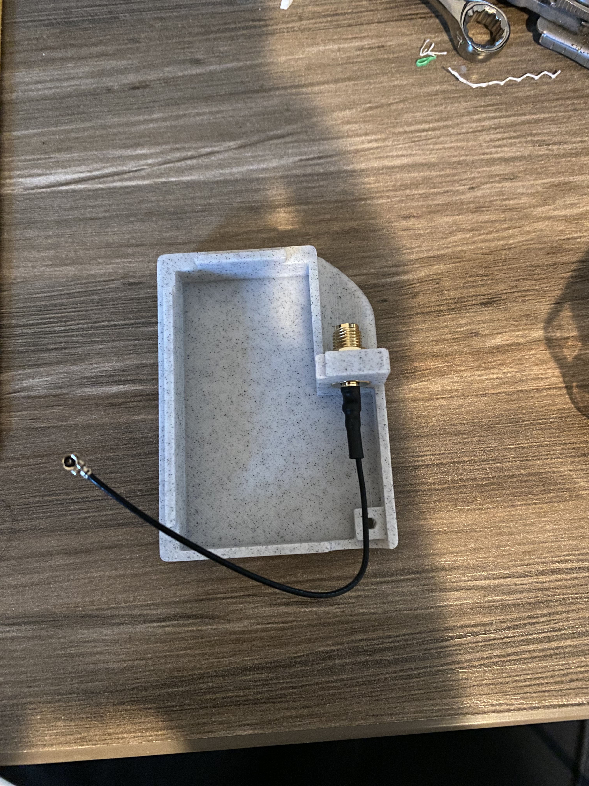
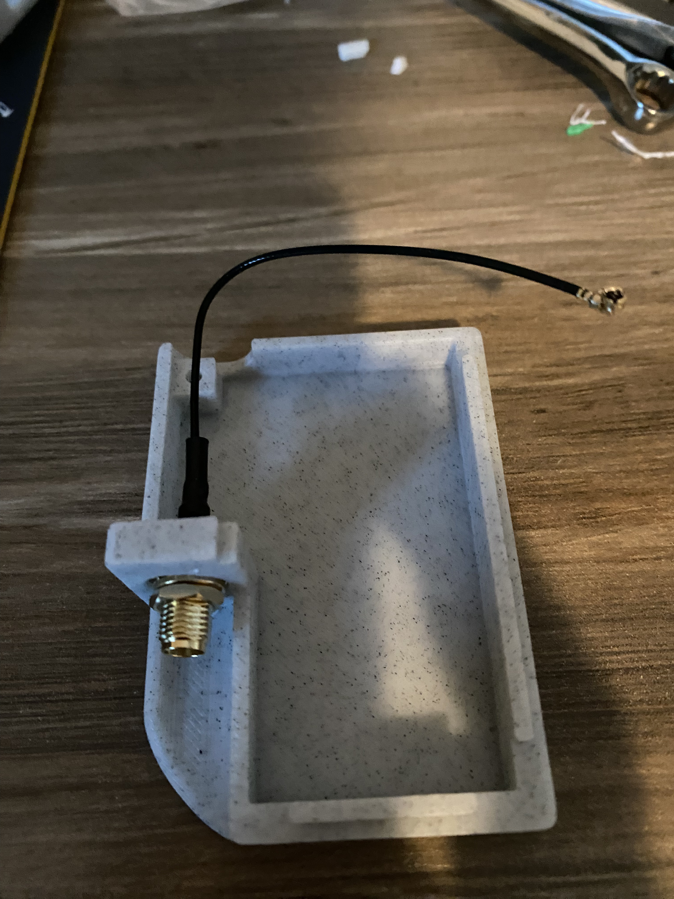
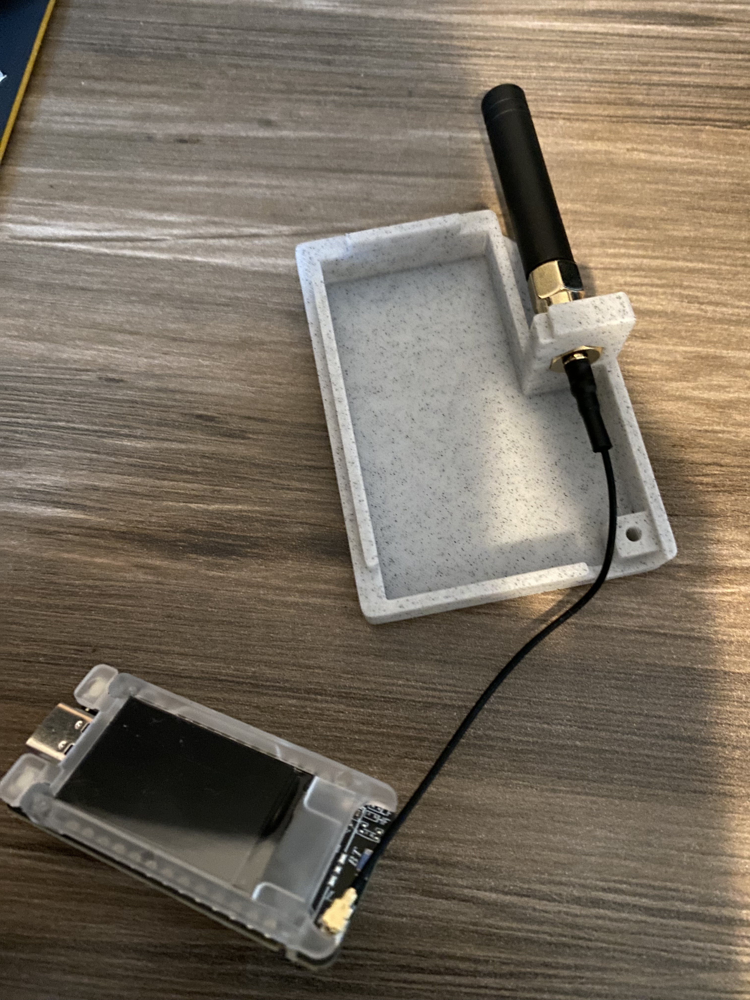
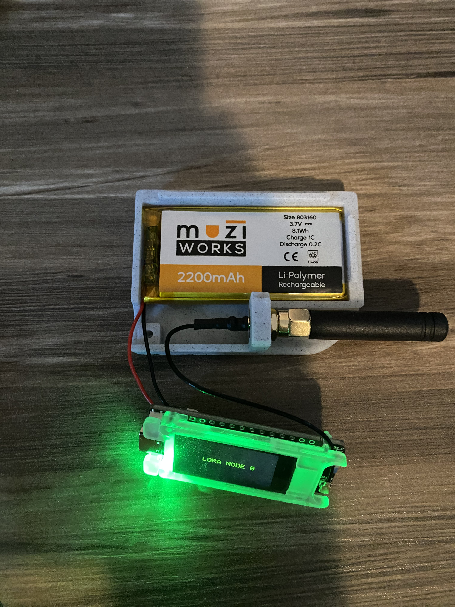
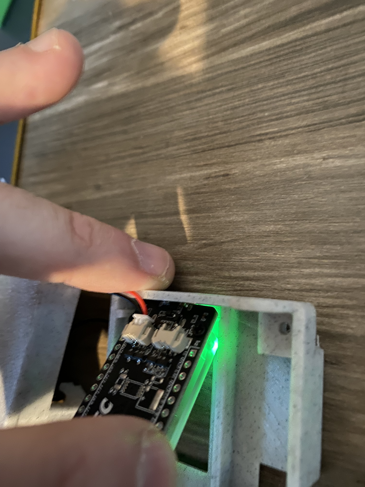
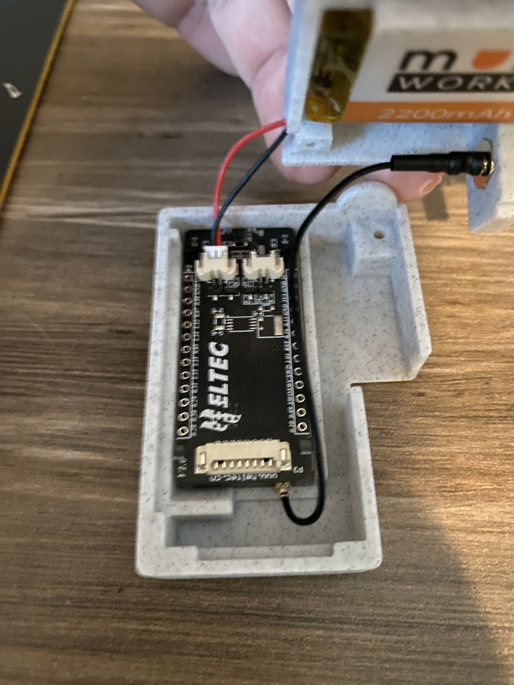
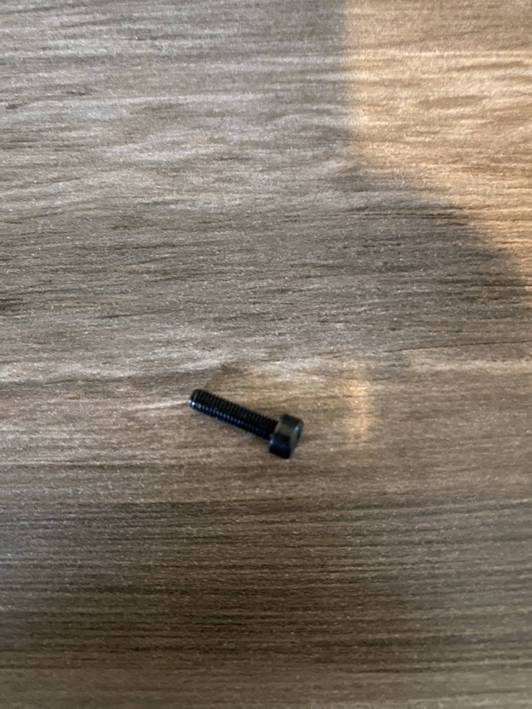
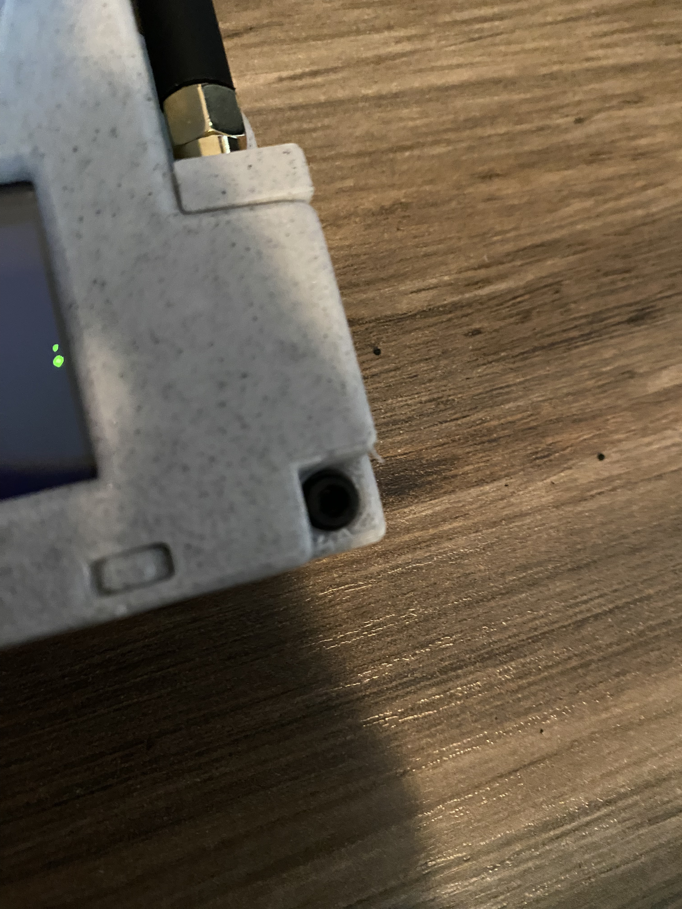

# Heltec T114 Build

I was intending to just build a muzi.works
H2T without the GPS, but found that the parts
I ordered did not fit into the H2T case that
I had printed, so I wound up designing my
own much clunkier cases. I had seen in the
[video](https://www.youtube.com/watch?v=D-HJOgFSNnE)
that I found Meshtastic through and through
some forum posts that it was possible
to share your phone's GPS with your radio.
My goal for the build was to make a walkie-talkie
style radio with a long battery life, and I
thought that skipping the GPS and choosing
an nRT52 based board could help preserve the
battery. Unfortunately, after completing
the build, I couldn't find the option to share my
phone GPS, but I'm not very good with computers,
so I might just be doing something wrong.

## Parts

If you want to build one of these guys, you'll
need three parts, all available from muzi.works.

1. [Heltec Mesh Node T114 w/Display](https://muzi.works/products/heltec-mesh-node-t114)
2. [H2T 2200 mAh Battery](https://muzi.works/products/h2t-battery)
3. [Screws](https://muzi.works/products/spare-screws-for-h1-case)

You may be able to source these from somewhere
else for cheaper, but that's where I got them.

Note that the pigtail connector and stub antenna come
with the T114 board, so there is no need to buy them
separately (though your mileage may vary when sourcing
from somewhere else).

## Case

My intention had been to use the H2T case designs
provided by muzi.works and simply leave the GPS
unit out, but I found that I couldn't
get the board I ordered to fit into the case I had
printed. I believe the display attached to the
board is slightly different (bulkier) than the one
used in the H2T.

That left me with no choice but to fire up OnShape
and try to design my own. As previously mentioned,
I'm not very good with technology, so I wound up
burning more PLA than I should on case iterations.
(This was exacerbated by the fact that all I had
was an inch ruler to measure for most of the design
process).

In the end I wound up with a case design somewhat
inspired by the H2T, but much blockier and without
any real attachment mechanisms. It uses tabs rather than
a separate piece for buttons, which works ok, but
not great, and there are no attachment mechanisms
for doing stuff like clipping to your belt or hanging
from a loop. I do think the flat bottom is an improvement
because it lets the radio stand upright on a table or
windowsill nicely.

## Assembly

Once you have printed your case, it is time to
assemble. Hopefully it is pretty intuitive, but
here is a step-by-step guide.

1. Mount the pigtail connector.  
2. Attach the stub antenna. 
3. Insert and attach the battery. 
4. Place the T114 board in the case.  
5. Screw the two halves together.  

