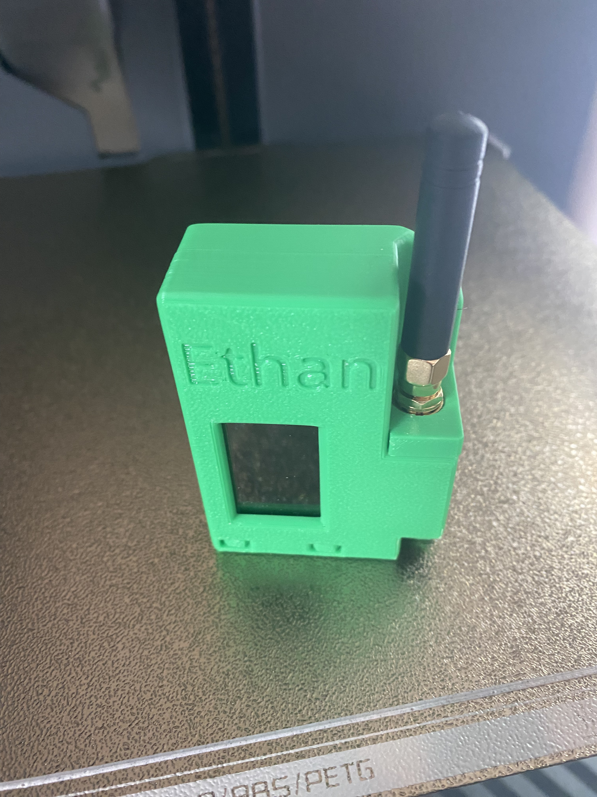
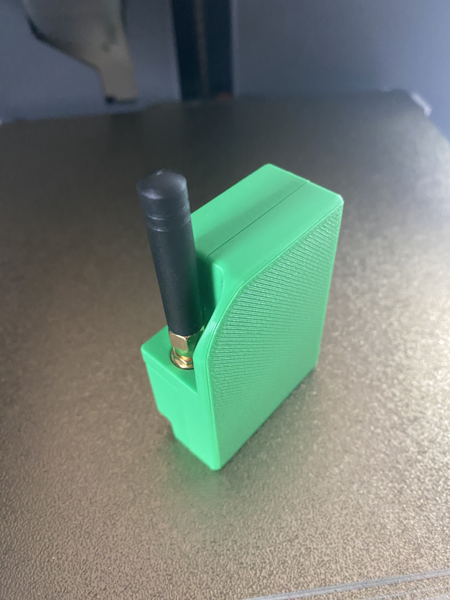

# Heltec T114 Build

I was intending to just build a muzi.works
H2T without the GPS, but found that the parts
I ordered did not fit into the H2T case that
I had printed, so I wound up designing my
own much clunkier cases. I had seen in the
[video](https://www.youtube.com/watch?v=D-HJOgFSNnE)
that I found Meshtastic through and through
some forum posts that it was possible
to share your phone's GPS with your radio.
My goal for the build was to make a walkie-talkie
style radio with a long battery life, and I
thought that skipping the GPS and choosing
an nRT52 based board could help preserve the
battery. Unfortunately, after completing
the build, I couldn't find the option to share my
phone GPS, but I'm not very good with computers,
so I might just be doing something wrong.

## Parts

If you want to build one of these guys, you'll
need three parts, all available from muzi.works.

1. [Heltec Mesh Node T114 w/Display](https://muzi.works/products/heltec-mesh-node-t114)
2. [H2T 2200 mAh Battery](https://muzi.works/products/h2t-battery)
3. [Screws](https://muzi.works/products/spare-screws-for-h1-case)

You may be able to source these from somewhere
else for cheaper, but that's where I got them.

Note that the pigtail connector and stub antenna come
with the T114 board, so there is no need to buy them
separately (though your mileage may vary when sourcing
from somewhere else).

The case parts can be printed from [the onshape project](https://cad.onshape.com/documents/fd3b9fa8cad9837d18ff8d54/w/1e6906b8b7d6d1deb327ab02/e/b1a6794dc717c3e66f6d45d0), or you
can just grab the stl files from [printables](https://www.printables.com/model/1018988-heltec-t114-2200-mah-battery-meshtastic-radio-case). If you want to add your own stenciling
work, forking the onshape project is probably best.

## Case

My intention had been to use the H2T case designs
provided by muzi.works and simply leave the GPS
unit out, but I found that I couldn't
get the board I ordered to fit into the case I had
printed. I believe the display attached to the
board is slightly different (bulkier) than the one
used in the H2T.

That left me with no choice but to fire up OnShape
and try to design my own. As previously mentioned,
I'm not very good with technology, so I wound up
burning more PLA than I should on case iterations.
(This was exacerbated by the fact that all I had
was an inch ruler to measure for most of the design
process).

In the end I wound up with a case design somewhat
inspired by the H2T, but much blockier and without
any real attachment mechanisms. It uses tabs rather than
a separate piece for buttons, which works ok, but
not great, and there are no attachment mechanisms
for doing stuff like clipping to your belt or hanging
from a loop. I do think the flat bottom is an improvement
because it lets the radio stand upright on a table or
windowsill nicely.

## Assembly

Once you have printed your case, it is time to
assemble. Hopefully it is pretty intuitive, but
here is a step-by-step guide.

1. Mount the pigtail connector.  
2. __Attach the stub antenna.__ Make sure to do this before attaching the battery. 
3. Insert and attach the battery. 
4. Place the T114 board in the case.  
5. Screw the two halves together.  

## Flashing

The nRF52 based boards unfortunately do not support
WebUSB based flashing, and the firmware for the T114
is not available from [meshtastic.org](https://meshtastic.org),
but the board vendor does provide a [meshtastic image](https://resource.heltec.cn/download/Mesh_Node_T114)
that I used initially flashing. I later learned
that there is an [issue with the T114](https://github.com/meshtastic/firmware/issues/4723#issuecomment-2369336696)
that has generated some workaround firmware, so you should
probably use that instead.

Download the .uf2 file and then plug the board into your
computer via USB-C. It should show up as a new drive
that you can drag-and-drop the .uf2 file to in order to
flash the board. After the file is copied, the device
will reboot and you should be running meshtastic.

I normally use linux, but I couldn't figure out how
to get this flow to work. I was hoping I could just
mount the radio as a regular mass storage device,
but it didn't show up in `lsblk` when I plugged
it in and wasn't picked up by the `dolphin` file
explorer. I found some programs called `nrfjprog`
and `jlink` which seem like they have something
to do with flashing nRF5x boards, but I couldn't
figure out how to get them to talk to the device.
In the end I wound up using my old macbook to flash
them via drag-and-drop.

Overall I was pretty dissatisfied by the flashing
experience, both because I couldn't flash the
boards from my regular computer and because
I would much rather get an image from upstream
than from a vendor.

## Final Product

## Assessment & Next Steps

I'm happy with the radios I wound up with, but
I'm not sure I'm going to build any more of these.
The trouble I've run into with sharing my phone
GPS is one factor, as is the image sourcing issue.

I'm somewhat satisfied with my case design, though
I might go back and add some attachment points and
try to make the buttons travel a bit smoother.

Also, after writing up this build, I found a
[reddit post](https://old.reddit.com/r/meshtastic/comments/1fp91ke/showcase_of_whats_the_actual_problem_with_the/)
saying that the T114 has problems transmitting
long messages at high power levels, which is
pretty disappointing. I would not recommend
doing this build. It does appear that heltec
is [taking the issue seriously](https://github.com/meshtastic/firmware/issues/4723#issuecomment-2369336696)
and working on finding a solution. For now,
there is a workaround firmware that you can
flash.

The next build I'm thinking of doing is a dog
unit, for which I want a big battery, no screen,
a GPS unit, a rubber port plug for waterproofing,
and a whip antenna, so the requirements are almost
entirely orthogonal.
